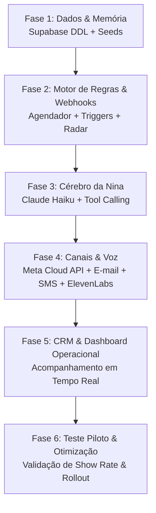

# Roadmap de Construção — SDR IA Nina (Agente Autônomo de Pré-Vendas)
> **Referência:** Documento [SDR-IA-Nina-Produto-e-Prompt.md](../SDR-IA-Nina-Produto-e-Prompt.md) baseado no case real da Nina (*Viver de IA*).  
> **Objetivo:** Eliminar no-show (taxa de presença de 21% para 40%+), reduzir custo de tráfego pago e operar multicanal de forma 100% autônoma e personalizada.

---

## Sumário Executivo das Fases

---

## Ordem Detalhada de Construção

### Fase 1: Fundação de Dados e Memória (Supabase / PostgreSQL)
*Objetivo: Estabelecer a persistência de dados, histórico conversacional, gestão de closers e base de conhecimento segmentada.*

- [x] **1.1 Estrutura de Banco de Dados (`schema.sql`):**
  - Tabela `leads`: Cadastro do lead, empresa, cargo, nicho/setor, telefone, DDD, e-mail, origem, UTMs e status.
  - Tabela `closers`: Vendedores responsáveis, agenda/calendário e link de atendimento.
  - Tabela `agendamentos`: ID da reunião, lead_id, closer_id, data/hora da reunião, status (agendado, confirmado, no-show, cancelado, compareceu), link da call.
  - Tabela `cases_sucesso`: Segmento/nicho, empresa exemplo, resultado chave, resumo do case para injeção de contexto.
  - Tabela `interacoes`: Log auditável de cada mensagem trocada (direção in/out, canal, tipo de mídia, payload, transcrição, resposta da IA).
  - Tabela `regras_agendadas`: Fila de tarefas para disparos futuros (lembrete 1h, lembrete 5 min, radar do silêncio, recuperação de abandono).
- [x] **1.2 Inserção de Dados Iniciais (Seeds):**
  - Cadastro de closers da equipe comercial.
  - População inicial de cases de sucesso por segmento de mercado.
  - Políticas de agendamento e perguntas frequentes (FAQs).

---

### Fase 2: Motor de Regras e Orquestração (Gatilhos e Timers)
*Objetivo: Garantir que a IA **não decida sozinha** horários ou regras críticas. O código/orquestrador controla rigorosamente quando agir; a IA personaliza o como.*

- [x] **2.1 Webhook de Entrada de Leads:**
  - Endpoint de captura de formulário (estilo Typeform).
  - Captura imediata do abandono: se o lead preencheu nome e telefone mas não agendou, criar registro com status `abandonou_formulario` e programar disparo em {{Y}} minutos.
- [x] **2.2 Agendamento das 6 Alavancas (Scheduler / Fila de Eventos):**
  - **Alavanca 1 (Confirmação Imediata):** Gatilho acionado imediatamente após o agendamento (< 2 min).
  - **Alavanca 2 (Lembrete 1h antes):** Tarefa agendada para executar exatamente 60 minutos antes da reunião.
  - **Alavanca 3 (Cerco de Última Hora):** Tarefa agendada para 5 minutos antes da call, disparando nos 3 canais simultaneamente.
  - **Alavanca 4 (Integração Google Calendar):** Geração e envio do convite de calendário com link da sala de reunião.
  - **Alavanca 5 (Radar do Silêncio):** Worker que roda a cada X minutos buscando leads que não responderam há mais de {{X}} horas para ativar a régua alternativa de cobrança.
  - **Alavanca 6 (Personalização de Case):** Consulta prévia do segmento para passar o case correto ao cérebro de IA.

---

### Fase 3: Módulo de IA (Claude Haiku + Tool Calling)
*Objetivo: Desenvolver o agente conversacional que fala como pré-vendas humano, consulta a base e executa ações seguras no CRM.*

- [x] **3.1 Integração com a API da Anthropic:**
  - Modelo configurado: Classe *Claude 3.5 / 4.5 Haiku* (alta velocidade, baixo custo e aderência impecável a tool calling).
  - Injeção do System Prompt rigoroso (especificado na Seção 4 do case).
- [x] **3.2 Implementação das Ferramentas (Function Calling):**
  - `buscar_lead_crm(identificador)`: Retorna histórico e dados contextuais.
  - `buscar_closer_responsavel(agendamento_id)`: Retorna nome e características do closer.
  - `buscar_case_por_segmento(segmento)`: Busca o case ideal na tabela `cases_sucesso`.
  - `criar_evento_calendario(lead, horario)`: Agenda no Google Calendar.
  - `atualizar_status_crm(lead_id, status)`: Atualiza confirmação no Supabase.
  - `enviar_whatsapp`, `enviar_email`, `enviar_sms`: Disparadores multicanal.
  - `gerar_audio(texto)`: Chamada para síntese de voz.
- [x] **3.3 Guardrails e Limites:**
  - Bloqueio de invenção de preços/descontos não previstos na base.
  - Tratamento elegante para leads que pedem cancelamento definitivo.
  - Repasse de dúvidas técnicas avançadas para o closer.

---

### Fase 4: Integrações de Mensageria e Síntese de Voz
*Objetivo: Conectar o motor aos canais de comunicação oficiais de forma robusta e multicanal.*

- [x] **4.1 WhatsApp (Meta Cloud API Oficial):**
  - Configuração de Webhook de recebimento de mensagens e status de entrega/leitura.
  - Configuração de templates de mensagem (HSM) para início de conversa e mensagens de sessão para bate-papo interativo.
- [x] **4.2 Integração com ElevenLabs (Voz Sintetizada):**
  - Configuração da voz clonada ou personalizada da Nina.
  - Geração de notas de voz em formato `.ogg / .opus` (áudio nativo do WhatsApp com onda sonora).
  - Regra de dosagem: uso estratégico em momentos de confirmação de alto valor para humanizar o contato.
- [x] **4.3 Disparos de E-mail e SMS:**
  - Conector de e-mail transacional (templates HTML limpos e responsivos).
  - Conector de SMS de última hora (mensagens curtas com link de acesso rápido).

---

### Fase 5: CRM Proprietário e Painel Operacional em Tempo Real
*Objetivo: Fornecer visibilidade completa da operação, auditoria das conversas e acompanhamento de KPIs.*

- [x] **5.1 Dashboard em Tempo Real:**
  - Monitor de conversas ativas da Nina em streaming.
  - Painel de intervenção humana (possibilidade do operador assumir o chat caso necessário).
- [x] **5.2 Gestão de Métricas Comerciais:**
  - Gráfico de *Show Rate* (Taxa de comparecimento diária/semanal).
  - Taxa de no-show evitado.
  - Volume de leads recuperados do abandono de formulário.
  - Desempenho por Closer e por Segmento de Mercado.
- [x] **5.3 Interface de Manutenção da Base de Conhecimento:**
  - Tela simples para adicionar novos cases de sucesso e ajustar respostas padrão de objeções.

---

### Fase 6: Homologação, Teste Piloto e Rollout
*Objetivo: Validar o funcionamento fim a fim antes de colocar em produção com tráfego real.*

- [x] **6.1 Testes de Ponta a Ponta com Mock Leads:**
  - Simulação de agendamento → Confirmação em < 2 min.
  - Simulação de lead responsivo vs. lead em silêncio absoluto.
  - Simulação de tentativa de cancelamento e perguntas fora do escopo.
- [x] **6.2 Rollout Gradual (Estratégia do Case):**
  - **Semana 1:** Operação restrita ao canal WhatsApp (texto).
  - **Semana 2:** Adição de e-mail e SMS nos momentos de cerco de 5 minutos.
  - **Semana 3:** Adição de áudios sintetizados via ElevenLabs.
  - **Semana 4:** Monitoramento contínuo e ajuste fino das réguas e cases.
